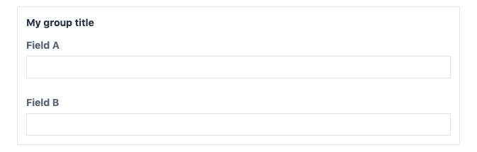
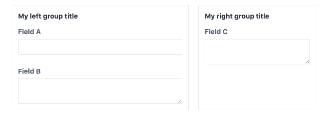
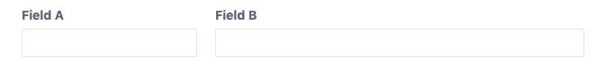

******
Fields
******

The content field ships with a wide variety of fields. The following field
types are included with the content field:

.. toctree::
   :maxdepth: 1
   :glob:

   fields/*

Common attributes
=================

The following attributes apply to all fields.

.. _fields-common-group:

:code:`group`
-------------

The group attribute allows you to group fields together. All following
fields will be put into a group until another group attribute occurs.
You can simply specify the label of the group:

.. code-block:: yaml

   label: Group demo
   fields:
     fieldA:
       type: text
       group: My group title
     fieldB:
       type: text

Which creates the following field group in the control panel:

You can also pass an option object to set multiple css properties
of the field group. Combined with the ability to specify grid layouts
on the schema (see ), you can build complex layouts.

.. code-block:: yaml

   label: Group demo
   grid: >
     "left right" / 3fr 2fr
   fields:
     fieldA:
       type: text
       group:
         label: My left group title
         gridArea: left
     fieldB:
       type: textarea

     fieldC:
       type: textarea
       group:
         label: My right group title
         gridArea: right

Which creates the following layout in the control panel:

The following css attributes are supported:

- alignSelf
- gridArea
- gridColumn
- gridColumnEnd
- gridColumnStart
- gridRow
- gridRowEnd
- gridRowStart
- justifySelf
- placeSelf

:code:`instructions`
--------------------

Additional instructions for the field in the control panel. Will be shown
beneath the field label.

.. code-block:: yaml

 instructions: Additional instructions for this field.

:code:`label`
-------------

The primary label of the input field in the control panel. When omitted, a
label will be generated from the name of the field.

.. code-block:: yaml

 label: My custom label

.. _fields-common-rules:

:code:`rules`
-------------

Defines the validation rules of the field. The content field uses the
validation mechanics of the Yii framework and you can use most of the
provided validators with the content field.

If you only need one validator and the validator does not require any
options, you may pass the name of the validator.

.. code-block:: yaml

   rules: required

Otherwise you may supply a list of validators. The name of the validator
must be given by the :code:`type` option. The following notation has the
same result as the previous example.

.. code-block:: yaml

   rules:
   - type: required

This way you can set additional options on each validator:

.. code-block:: yaml

   rules:
   - type: required
   - type: email
     checkMX: true

.. note::
   A list of all validators can be found here:
   https://www.yiiframework.com/wiki/56/reference-model-rules-validation

:code:`width`
-------------

The width of the field in the control panel, allows you to stack fields
horizontally. Usually given as a fraction, e.g. :code:`6/12`.

.. code-block:: yaml

   label: Width demo
   fields:
     fieldA:
       type: text
        width: 4/12
     fieldB:
       type: text
       width: 8/12

Which creates the following layout in the control panel:

Common templating
=================

All fields can be directly printed within your templates. Please refer
to the individual field documentations for a description of the return
value.

.. code-block:: twig

   {{ fieldName }}

:code:`html`
------------

All fields have a html helper function that returns a twig html node and
ensures that html content gets rendered correctly.

.. code-block:: twig

   {{ fieldName.html }}

:code:`hasValue`
----------------

You can check whether a field contains a value using the :code:`hasValue` helper.

.. code-block:: twig

   
     {{ fieldName.html }}
   

:code:`isEmpty`
---------------

For better template readability we also provide the :code:`isEmpty` helper which
simply returns the opposite of :code:`hasValue`.

.. code-block:: twig

   
     
Fallback content

   
