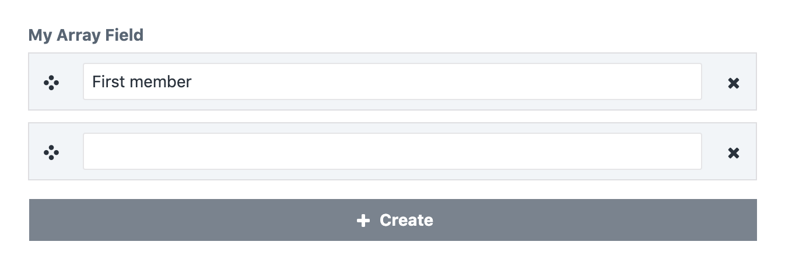

# Array field

The array field allows editors to create a sequence of values. All members
of an array are of the same member field type defined by the `member`
attribute. A simple array field definition looks like this:

```yaml
myArrayField:
  type: array
  member:
    type: text
```

This field definition creates the following input in the control panel:



::: tip
The array field is most commonly used with a member of type `instance`. We have
a shortcut for specifying arrays of instances. See [instances](instances.md) field.
:::

::: tip
You don't need an array field to store multiple references. The reference field is
capable of holding multiple references by itself. See [reference](reference.md) field.
:::

## Options

<tcf-field-attribs />

### `limit`

The maximum number of allowed items in the array. Once the limit is reached,
the create button will disappear and the user can no longer drop new items into
the field.

```yaml{3}
myArrayField:
  type: array
  limit: 3
  member:
    type: text
```

### `member`

Declares the field each item in the array will use. All available fields
except the `array` field itself can be used. You cannot specify a `name`
for array member fields.

```yaml{3,4}
myArrayField:
  type: array
  member:
    type: text
```

## Templating

The array field exposes an instance of `lenz\contentfield\models\values\ArrayValue`
to templates.

### Array access

The class `ArrayValue` implements both the `ArrayAccess` and the `Countable` interface.
You can therefore access individual items directly using the array access syntax and
check the length of the array using the `length` filter.

```twig

  <p>{{ myArrayField[0] }}</p>

```

### ``

The class `ArrayValue` implements the `IteratorAggregate` interface. You can therefore loop
through array values using the default twig `for` tag.

```twig
label: Array field example
fields:
  myArrayField:
    type: array
    member:
      type: text
---
<ul>
  
    <li>{{ item }}</li>
  
</ul>
```

### `getFirst()` / `first`

Retrieves the first visible value of the array.

```twig

  <p>First value: {{ myArrayField.first }}</p>

```

### `getValues()` / `values`

Returns a native PHP array containing the field values.

```twig

```

### `hasValue()` / `isEmpty()`

Checks whether the array contains any values.

```twig

  ...

```
