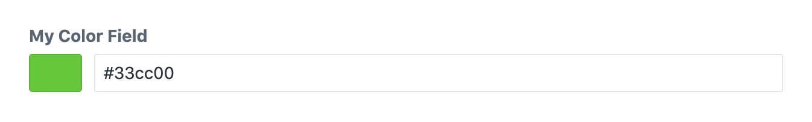

***********
Color field
***********

The color field allows editors to freely select a color.

.. code-block:: yaml

  simpleColorField:
    type: color
    label: My simple color

This field definition creates the following input in the control panel:

.. note::
   If you want the editor only to be able to pick from a fixed
   set of colors, see :doc:`swatch-color-field`.

Field attributes
================

.. include:: ../_includes/common-field-properties.rst

.. rubric::
   Color attributes

.. list-table::
   :widths: 30 70
   :header-rows: 1

   * - Property
     - Description

   * - disableAlpha
     - Hides the alpha setting in the color popup. This is turned
       on by default.
   * - presetColors
     - Allows you to specify multiple predefined color values.

:code:`disableAlpha`
--------------------

Hides the alpha setting in the color popup. This is turned on by default.

.. code-block:: yaml

  disableAlpha: false

:code:`presetColors`
--------------------

Allows you to specify multiple predefined color values. Must be a list
of hex color values.

.. code-block:: yaml

  presetColors:
  - "#ff0000"
  - "#00ff00"
  - "#0000ff"

.. warning::
   You must quote hex color values in YAML.

Templating
==========

You can print a color field in twig to output its css color representation.

.. code-block:: twig

  label: Color field demo
  fields:
    colorField:
      type: color
  ---
  
</ul>
