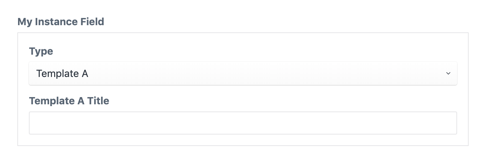

**************
Instance field
**************

The instance field allows a field to hold another template (or schema)
allowing you to build nested hierarchies.

.. code-block:: yaml

  simpleInstance:
    type: instance
    label: My simple instance
    schemas:
    - path/to/template-a.twig
    - path/to/template-b.twig

This field definition creates the following input in the control panel:

Field attributes
================

.. include:: ../_includes/common-field-properties.rst

.. rubric::
   Instance attributes

.. list-table::
   :widths: 30 70
   :header-rows: 1

   * - Property
     - Description

   * - **schemas**
     - Required. A list of all allowed schemas. If multiple schemas are
       specified, a dropdown will be shown in the control panel.

:code:`schemas`
---------------

A list of all allowed schemas. If multiple schemas are specified, a dropdown
will be shown in the control panel. This can either be a single string or a list
of schema names.

.. code-block:: yaml

    schemas:
    - path/to/template-a.twig
    - path/to/template-b.twig

You may use wildcards to include entire directories.

.. code-block:: yaml

    schemas: path/to/*

Templating
==========

You can render the template of the instance field by using the :code:`display`
twig tag.

.. code-block:: twig

  label: Instance field demo
  fields:
    instanceField:
      type: instance
      schemas: blocks/*
  ---
  

You can also use the :code:`html` utility function to retrieve the rendered
template as a twig html node.

.. code-block:: twig

  {{ instanceField.html }}

The :code:`html` utility function allows you to pass additional template
variables:

.. code-block:: twig

  {{ instanceField.html({
    extraValue: 'Some value'
  }) }}

The instance contains the full data set of the schema and you can directly
access fields defined on the schema:

.. code-block:: twig

  {{ instanceField.title }}

