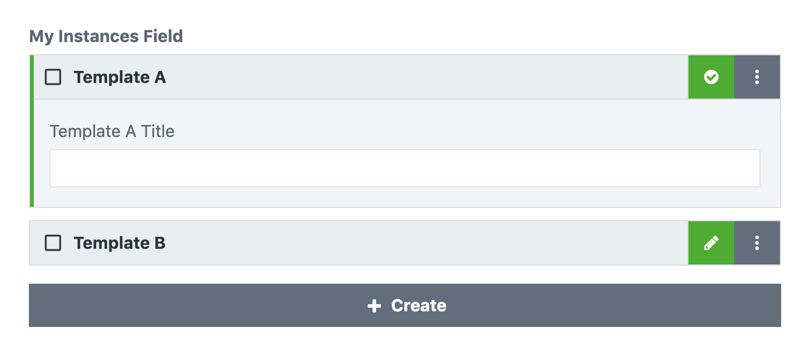

***************
Instances field
***************

The instances field allows editors to create a sequence of different
instances and is the most powerful field type the content field has to
offer. Under the hood this is a preconfigured array field, it therefore
borrows attributes from the array and instance fields.

.. code-block:: yaml

  simpleInstances:
    type: instances
    label: My simple instances
    schemas:
    - path/to/template-a.twig
    - path/to/template-b.twig

This field definition creates the following input in the control panel:

Field attributes
================

.. include:: ../_includes/common-field-properties.rst

.. rubric::
   Array attributes

.. list-table::
   :widths: 30 70
   :header-rows: 1

   * - Property
     - Description

   * - collapsible
     - Displays the list items in the control panel as collapsible cards.
       This is turned on by default.

.. rubric::
   Instance attributes

.. list-table::
   :widths: 30 70
   :header-rows: 1

   * - Property
     - Description

   * - **schemas**
     - Required. A list of all allowed schemas. If multiple schemas are
       specified, a dropdown will be shown in the control panel.

Templating
==========

You can render all templates of the instances field by using the :code:`display`
twig tag.

.. code-block:: twig

  label: Instances field demo
  fields:
    instancesField:
      type: instance
      schemas: blocks/*
  ---
  

You can also use the :code:`html` utility function to retrieve the rendered
templates as a twig html node.

.. code-block:: twig

  {{ instancesField.html }}

The :code:`html` utility function allows you to pass additional template
variables:

.. code-block:: twig

  {{ instancesField.html({
    extraValue: 'Some value'
  }) }}
