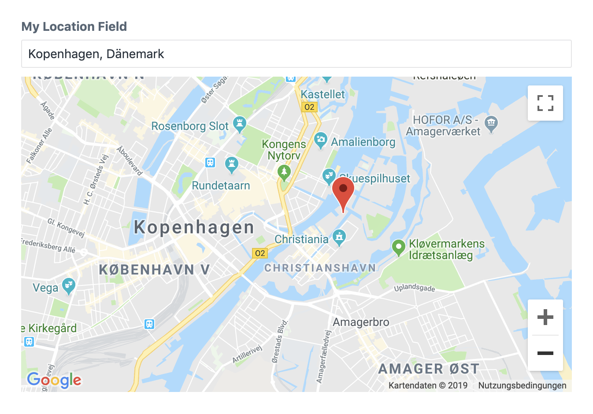

**************
Location field
**************

The location field allows the editor to pick a location on a map.

.. code-block:: yaml

  simpleLocation:
    type: location
    label: My simple location

This field definition creates the following input in the control panel:

.. note::
   The location field uses Google Maps to display maps. You must specify
   a Google Maps API key in the field settings, see :doc:`../advanced/settings`.

Field attributes
================

.. include:: ../_includes/common-field-properties.rst

.. rubric::
   Location attributes

.. list-table::
   :widths: 30 70
   :header-rows: 1

   * - Property
     - Description

   * - defaultValue
     - Specifies a default location. When not given, the field will pick
       a default location based on the locale of the current site.

:code:`defaultValue`
--------------------

Specifies a default location. When not given, the field will pick
a default location based on the locale of the current site.

.. code-block:: yaml

  defaultValue:
    latitude: 52.51666667
    longitude: 13.4

Templating
==========

Printing the location field returns the latitude and longitude values
as a coma separated string.

.. code-block:: twig

  label: Location field demo
  fields:
    locationField:
      type: location
  ---
  

:code:`latitude`
----------------

Returns the latitude value.

.. code-block:: twig

  {{ locationField.latitude }}

:code:`longitude`
-----------------

Returns the longitude value.

.. code-block:: twig

  {{ locationField.longitude }}
