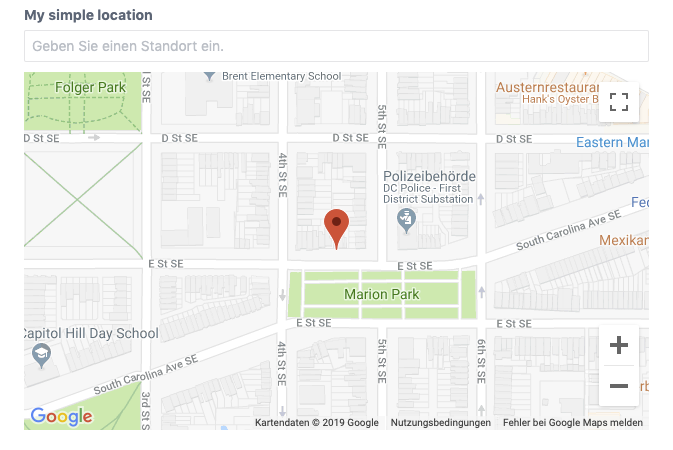

# Location field

The location field allows the editor to pick a location on a map.

```yaml
simpleLocation:
  type: location
  label: My simple location
```

This field definition creates the following input in the control panel:



::: tip
The location field uses Google Maps to display maps. You must specify
a Google Maps API key in the field settings, see :doc:`../advanced/settings`.
:::

## Attributes

<tcf-field-attribs :attributes="$page.frontmatter.attributes" />

### `defaultValue`

Specifies a default location. When not given, the field will pick
a default location based on the locale of the current site.

```yaml
defaultValue:
  latitude: 52.51666667
  longitude: 13.4
```

## Templating

Printing the location field returns the latitude and longitude values
as a coma separated string.

```twig
label: Location field demo
fields:
  locationField:
    type: location
---

```

### `latitude`

Returns the latitude value.

```twig
{{ locationField.latitude }}
```

### `longitude`

Returns the longitude value.

```twig
{{ locationField.longitude }}
```
