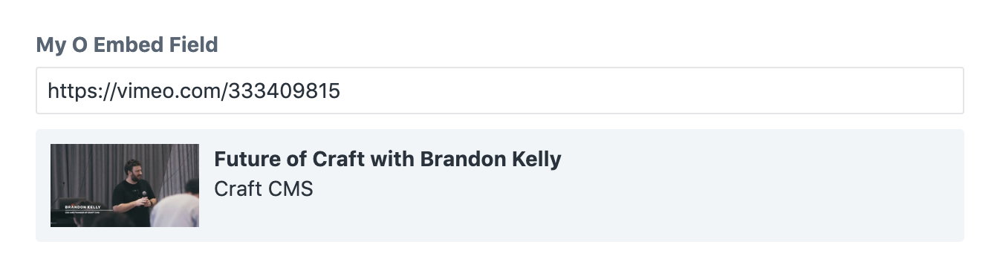

************
OEmbed field
************

The oembed field allows the editor to enter the url of a service that
support oembed, e.g. YouTube or Twitter. The field displays a snippet
of the selected oembed content for validation.

.. code-block:: yaml

  simpleOEmbed:
    type: oembed
    label: My simple oembed
    providers:
    - YouTube
    - Vimdeo

This field definition creates the following input in the control panel:

Field attributes
================

.. include:: ../_includes/common-field-properties.rst

.. rubric::
   OEmbed attributes

.. list-table::
   :widths: 30 70
   :header-rows: 1

   - - Property
     - Description

   - - **providers**
     - Required. A list defining the allowed oembed services.

:code:`providers`
-----------------

A list defining the allowed oembed services. Oembed services are identified
by their service names as returned by the oembed registry at
https://oembed.com/providers.json

.. code-block:: yaml

  providers:
  - YouTube
  - Vimdeo

You can also supply a coma separated list of provider names:

.. code-block:: yaml

  providers: YouTube,Vimdeo

The definitions returned by oembed.com may not always be complete and
correct, you can alter or register providers by modifying the static
variable :code:`$CUSTOM_DEFINITIONS` of the class
:code:`lenz\contentfield\utilities\oembed\Provider`.

.. note::
   Keep in mind that the Craft CMS needs to make requests to both
   :code:`oembed.com` and to all enabled providers when using this
   field. Set your firewall rules accordingly.

Templating
==========

Printing the oembed field will return the url of the embedded content:

.. code-block:: twig

  label: Location field demo
  fields:
    oembedField:
      type: oembed
      providers: YouTube
  ---
  <a href="{{ oembedField }}">Embedded content</a>

:code:`html`
------------

Returns the embed code as a twig html node.

.. code-block:: twig

  {{ oembedField.html }}

The :code:`html` helper allows you pass additional properties to alter
the embed tag and url:

.. code-block:: twig

  {{ oembedField.html({
    attributes: {
      width: 640,
      height: 480,
    },
    query: {
      autoPlay: 1,
    },
  }) }}

.. rubric::
   Attributes

To modify the attributes of embed tag you can pass the option
:code:`attributes`. It must be an object whose keys describe the
attributes you want to modify. The values describe what should be
done with the attributes:

 - Set the attribute by passing a value:

   .. code-block:: twig

     {{ oembedField.html({
       attributes: {
         width: 640,
       }
     }) }}

 - Remove an attribute by passing :code:`NULL`:

   .. code-block:: twig

     {{ oembedField.html({
       attributes: {
         width: null,
       }
     }) }}

 - Rename an attribute by passing an object containing the key :code:`rename`:

   .. code-block:: twig

     {{ oembedField.html({
       attributes: {
         width:
           rename: data-width
       }
     }) }}

.. rubric::
   Query

To modify the url of the embed tag you can pass the option
:code:`query`. It must be an object whose keys describe the
query parameters you want to modify. The values describe what
should be done with the query parameters:

 - Set a query parameter by passing a value:

   .. code-block:: twig

     {{ oembedField.html({
       query: {
         autoPlay: 1,
       }
     }) }}

 - Remove a query parameter by passing :code:`NULL`:

   .. code-block:: twig

     {{ oembedField.html({
       query: {
         autoPlay: null,
       }
     }) }}

:code:`oEmbed` / :code:`getOEmbed`
----------------------------------

You can also access the full oembed data returned by the api. This data
is automatically cached by the oembed field. The oembed endpoints may
return different data sets based on the provider you choose, but usually
return the following fields:

.. list-table::
   :widths: 30 70
   :header-rows: 1

   - - Property
     - Description

   - - type
     - The resource type.

   - - version
     - The oEmbed version number. This must be 1.0.

   - - title
     - A text title, describing the resource.

   - - author_name
     - The name of the author/owner of the resource.

   - - author_url
     - A URL for the author/owner of the resource.

   - - provider_name
     - The name of the resource provider.

   - - provider_url
     - The url of the resource provider.

   - - cache_age
     - The suggested cache lifetime for this resource, in seconds. Consumers
       may choose to use this value or not.

   - - thumbnail_url
     - A URL to a thumbnail image representing the resource. The thumbnail
       must respect any maxwidth and maxheight parameters. If this parameter
       is present, thumbnail_width and thumbnail_height must also be present.

   - - thumbnail_width
     - The width of the optional thumbnail. If this parameter is present,
       thumbnail_url and thumbnail_height must also be present.

   - - thumbnail_height
     - The height of the optional thumbnail. If this parameter is present,
       thumbnail_url and thumbnail_width must also be present.

   - - html
     - The HTML required to embed a video player. The HTML should have no
       padding or margins.

   - - width
     - The width in pixels required to display the HTML.

   - - height
     - The height in pixels required to display the HTML.

.. code-block:: twig

  
  
    <dl>
      <dt>Title:</dt>
      <dd>{{ payload.title }}</dd>
      <dt>Author:</dt>
      <dd>{{ payload.author_name }}</dd>
      <dt>Thumbnail:</dt>
      <dd>{{ payload.thumbnail_url }}</dd>
    </dl>
  

Aliases
=======

:code:`youtube`
---------------

The field type alias :code:`youtube` will be rewritten to an oembed field
whose attribute :code:`providers` is set to :code:`YouTube`:

.. code-block:: yaml

  youtubeField:
    type: youtube
