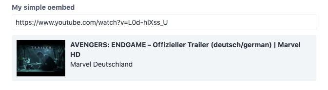

# OEmbed field

The oembed field allows the editor to enter the url of a service that
support oembed, e.g. YouTube or Twitter. The field displays a snippet
of the selected oembed content for validation.

```yaml
myOEmbedField:
  type: oembed
  providers:
    - YouTube
    - Vimeo
```

This field definition creates the following input in the control panel:



## Attributes

<tcf-field-attribs :attributes="$page.frontmatter.attributes" />

### `providers`

A list defining the allowed oembed services. Oembed services are identified
by their service names as returned by the oembed registry at
[oembed.com](https://oembed.com/providers.json).

```yaml
providers:
  - YouTube
  - Vimdeo
```

You can also supply a coma separated list of provider names:

```yaml
providers: YouTube,Vimdeo
```

The definitions returned by oembed.com may not always be complete and
correct, you can alter or register providers by modifying the static
variable `$CUSTOM_DEFINITIONS` of the class
`lenz\contentfield\services\oembeds\Provider`.

::: tip
Keep in mind that the Craft CMS needs to make requests to both
`oembed.com` and to all enabled providers when using this
field. Set your firewall rules accordingly.
:::

## Templating

Printing the oembed field will return the url of the embedded content:

```twig
label: Location field demo
fields:
  oembedField:
    type: oembed
    providers: YouTube
---
<a href="{{ oembedField }}">Embedded content</a>
```

### `html`

Returns the embed code as a twig html node.

```twig
{{ oembedField.html }}
```

The `html` helper allows you pass additional properties to alter
the embed tag and url:

```twig
{{ oembedField.html({
  attributes: {
    width: 640,
    height: 480,
  },
  query: {
    autoPlay: 1,
  },
}) }}
```

#### attributes

To modify the attributes of embed tag you can pass the option
`attributes`. It must be an object whose keys describe the
attributes you want to modify. The values describe what should be
done with the attributes:

- Set the attribute by passing a value:

  ```twig
  {{ oembedField.html({
    attributes: {
      width: 640,
    }
  }) }}
  ```

- Remove an attribute by passing `NULL`:

  ```twig
  {{ oembedField.html({
    attributes: {
      width: null,
    }
  }) }}
  ```

- Rename an attribute by passing an object containing the key `rename`:

  ```twig
  {{ oembedField.html({
    attributes: {
      width: {
        rename: 'data-width'
      }
    }
  }) }}
  ```

#### query

To modify the url of the embed tag you can pass the option
`query`. It must be an object whose keys describe the query
parameters you want to modify. The values describe what should
be done with the query parameters:

- Set a query parameter by passing a value:

  ```twig
  {{ oembedField.html({
    query: {
      autoPlay: 1,
    }
  }) }}
  ```

- Remove a query parameter by passing `NULL`:

  ```twig
  {{ oembedField.html({
    query: {
      autoPlay: null,
    }
  }) }}
  ```

### `oEmbed` / `getOEmbed`

You can also access the full oembed data returned by the api. This data
is automatically cached by the oembed field. The oembed endpoints may
return different data sets based on the provider you choose, but usually
return the following fields:

<div>
  <tcf-attribs>
    <tcf-attrib name="type">
      The resource type.
    </tcf-attrib>
    <tcf-attrib name="version">
      The oEmbed version number. This must be 1.0.
    </tcf-attrib>
    <tcf-attrib name="title">
      A text title, describing the resource.
    </tcf-attrib>
    <tcf-attrib name="author_name">
      The name of the author/owner of the resource.
    </tcf-attrib>
    <tcf-attrib name="author_url">
      A URL for the author/owner of the resource.
    </tcf-attrib>
    <tcf-attrib name="provider_name">
      The name of the resource provider.
    </tcf-attrib>
    <tcf-attrib name="provider_url">
      The url of the resource provider.
    </tcf-attrib>
    <tcf-attrib name="cache_age">
      The suggested cache lifetime for this resource, in seconds. 
      Consumers may choose to use this value or not.
    </tcf-attrib>
    <tcf-attrib name="thumbnail_url">
      A URL to a thumbnail image representing the resource. The thumbnail
      must respect any maxwidth and maxheight parameters. If this parameter
      is present, thumbnail_width and thumbnail_height must also be present.
    </tcf-attrib>
    <tcf-attrib name="thumbnail_width">
      The width of the optional thumbnail. If this parameter is present,
      thumbnail_url and thumbnail_height must also be present.
    </tcf-attrib>
    <tcf-attrib name="thumbnail_height">
      The height of the optional thumbnail. If this parameter is present,
      thumbnail_url and thumbnail_width must also be present.
    </tcf-attrib>
    <tcf-attrib name="html">
      The HTML required to embed a video player. The HTML should have no
      padding or margins.
    </tcf-attrib>
    <tcf-attrib name="width">
      The width in pixels required to display the HTML.
    </tcf-attrib>
    <tcf-attrib name="height">
      The height in pixels required to display the HTML.
    </tcf-attrib>
  </tcf-attribs>
</div>

```twig


  <dl>
  <dt>Title:</dt>
  <dd>{{ payload.title }}</dd>
  <dt>Author:</dt>
  <dd>{{ payload.author_name }}</dd>
  <dt>Thumbnail:</dt>
  <dd>{{ payload.thumbnail_url }}</dd>
</dl>

```

## Aliases

### `youtube`

The field type alias `youtube` will be rewritten to an oembed field
whose attribute `providers` is set to `YouTube`:

```yaml
youtubeField:
  type: youtube
```
