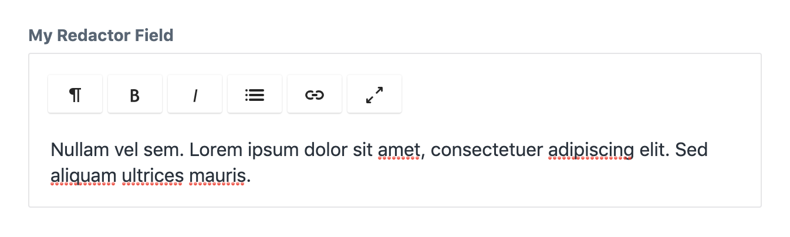

# Redactor field

The redactor field allows the editor to enter rich text formatted using
the Redactor plugin provided by Craft CMS.

```yaml
simpleRedactor:
  type: redactor
  label: My simple Redactor
```

This field definition creates the following input in the control panel:



::: warning
You must install the Craft Redactor plugin from the plugin store in
order to use this field type.
:::

## Attributes

<tcf-field-attribs :attributes="$page.frontmatter.attributes" />

### `purifierConfig`

Allows you to configure the html purifier. A list of all available purifier options
can be found here: http://htmlpurifier.org/live/configdoc/plain.html

```yaml
purifierConfig:
  Attr.EnableID: true
  Attr.AllowedFrameTargets: - \_blank
  HTML.AllowedComments: - pagebreak
```

### `redactorConfig`

Specifies the redactor config to use. Defaults to :code:`Standard.json`.

```yaml
redactorConfig: Simple.json
```

### `translatable`

Defines whether the text field will be translated when synchronizing
content fields across sites. Defaults to false.

```yaml
translatable: true
```

## Templating

Printing the redactor field will return html contents of the field. Remember
to apply the raw filter when doing this:

```twig
label: Redactor field demo
fields:
  redactorField:
    type: redactor
---
{{ redactorField|raw }}
```

## `html`

Returns the html contents as a twig html node.

```twig
{{ redactorField.html }}
```
