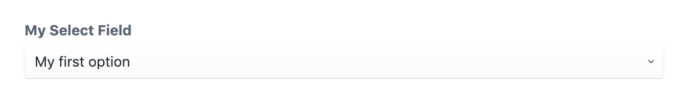

************
Select field
************

The select field allows the editor to select one of several predefined
options from a dropdown.

.. code-block:: yaml

  simpleSelect:
    type: select
    label: My simple select
    options:
      first: My first option
      second: My second option

This field definition creates the following input in the control panel:

Field attributes
================

.. include:: ../_includes/common-field-properties.rst

.. rubric::
   Select attributes

.. list-table::
   :widths: 30 70
   :header-rows: 1

   * - Property
     - Description

   * - options
     - Defines the available static options.

   * - enumeration
     - The qualifier of an enumeration class that defines the available
       options. Used to programmatically declare options.

:code:`options`
---------------

Defines the available static options. This can be given as a simple hash map.

.. code-block:: yaml

  options:
    first: My first option
    second: My second option

You can also specify the available options as an array of objects each
containing a :code:`key` and :code:`label` value. The above example
produces the identical result as the following notation:

.. code-block:: yaml

  options:
    - key: first
      label: My first option
    - key: second
      label: My second option

This notation allows you to attach additional values to each option which
can be accessed inside your template:

.. code-block:: twig

  label: Option extra values demo
  fields:
    selectField:
      type: select
      options:
        - key: first
          label: My first option
          className: firstCssClass
        - key: second
          label: My second option
          className: secondCssClass
  ---
  

    {{ selectField.label }}
  

:code:`enumeration`
-------------------

The qualifier of an enumeration class that defines the available
options. Used to programmatically declare options, override any
static options.

.. code-block:: yaml

  enumeration: myModule\DemoEnumeration

You must declare a php class implementing the interface
:code:`EnumerationInterface`. The :code:`getOptions` must return
the available options as :code:`key` / :code:`label` pairs.

.. code-block:: php

  <?php

  namespace myModule;
  use lenz\contentfield\models\enumerations\EnumerationInterface;

  class DemoEnumeration implements EnumerationInterface
  {
    /**
     * @param string|int $key
     * @param string $name
     * @return mixed
     */
    public function getCustomData($key, $name) {
      return null;
    }

    /**
     * Return an array of all options.
     * @return array
     */
    public function getOptions() {
      return [
        [
          'key'   => 'first'
          'label' => 'My first option'
        ],
        [
          'key'   => 'second'
          'label' => 'My second option'
        ],
      ];
    }
  }

Templating
==========

Printing the select field will return the key of the selected option.

.. code-block:: twig

  label: Select field demo
  fields:
    selectField:
      type: select
      options:
        first: My first option
        second: My second option
  ---
  {{ selectField }}

You can access the properties of the selected item:

.. code-block:: twig

  {{ selectField.label }}
