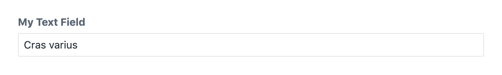

**********
Text field
**********

The text field allows the editor to enter a single line of text.

.. code-block:: yaml

  simpleText:
    type: text
    label: My simple text

This field definition creates the following input in the control panel:

Field attributes
================

.. include:: ../_includes/common-field-properties.rst

.. rubric::
   Text attributes

.. list-table::
   :widths: 30 70
   :header-rows: 1

   * - Property
     - Description

   * - translatable
     - Defines whether the text field will be translated when synchronizing
       content fields across sites. Defaults to false.

:code:`translatable`
--------------------

Defines whether the text field will be translated when synchronizing
content fields across sites. Defaults to false.

.. code-block:: yaml

  translatable: true

Templating
==========

Printing the text field returns the textual contents of the field.

.. code-block:: twig

  label: Text field demo
  fields:
    textField:
      type: text
  ---
  <h1>{{ textField }}</h1>

:code:`html`
------------

Returns the contents of the text field as a twig html node.

.. code-block:: twig

  <h1>{{ textField.html }}</h1>
