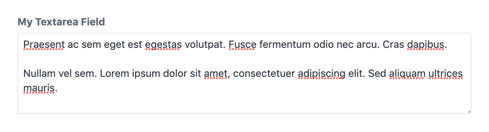

# Textarea field

The textarea field allows the editor to enter multiple lines of text.

```yaml
simpleTextarea:
  type: textarea
  label: My simple textarea
```

This field definition creates the following input in the control panel:



## Attributes

<tcf-field-attribs :attributes="$page.frontmatter.attributes" />

### `translatable`

Defines whether the text field will be translated when synchronizing
content fields across sites. Defaults to false.

```yaml
translatable: true
```

## Templating

Printing the textarea field returns the textual contents of the field.

```twig
label: Textarea field demo
fields:
  textareaField:
    type: textarea
---
<p>{{ textareaField }}</p>
```

## `html`

Returns the contents of the textarea field as a twig html node.

```twig
<p>{{ textareaField.html }}</p>
```
