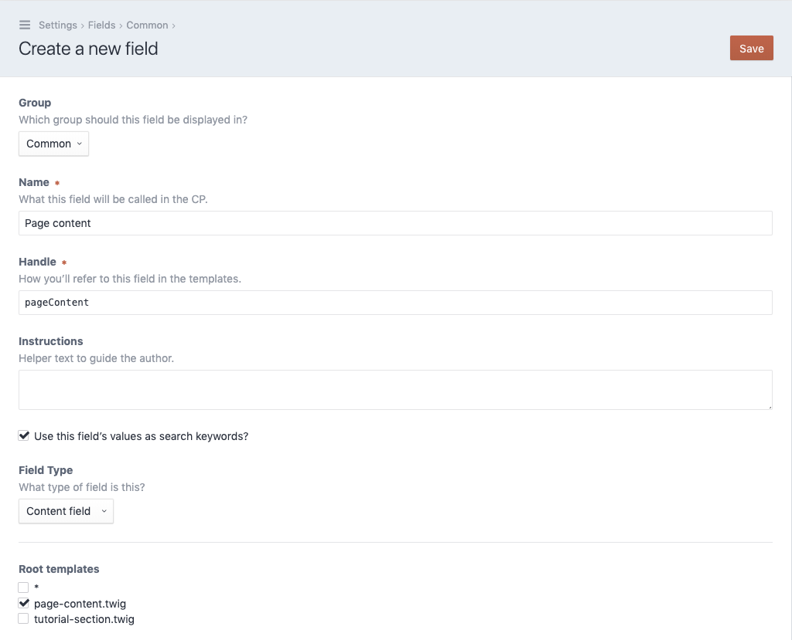
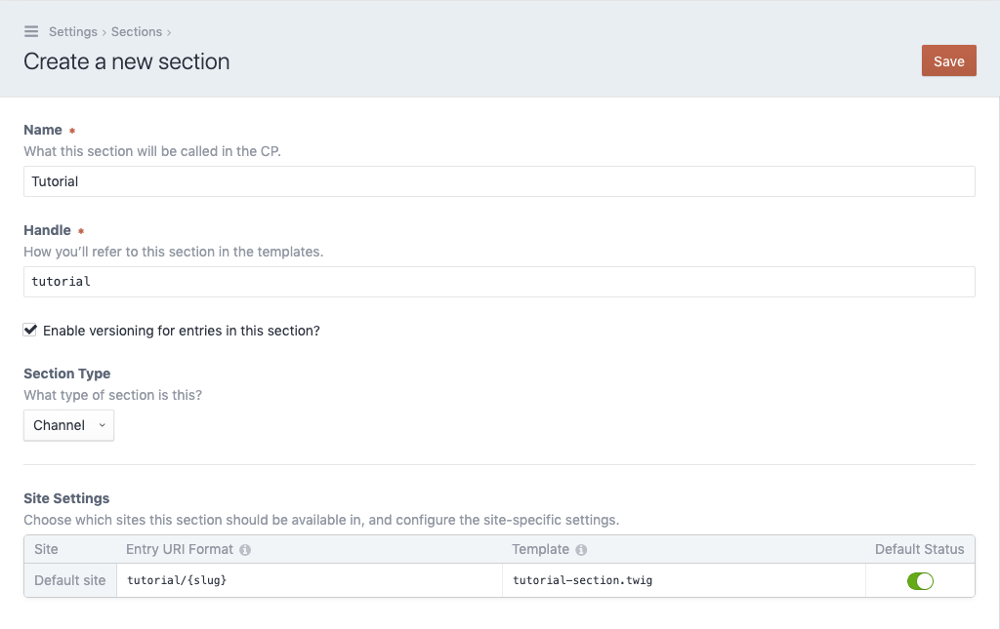
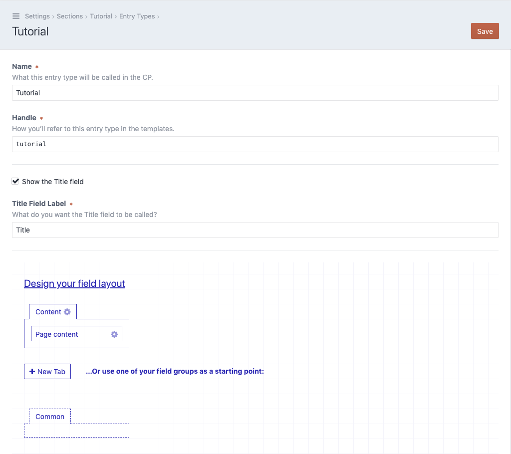
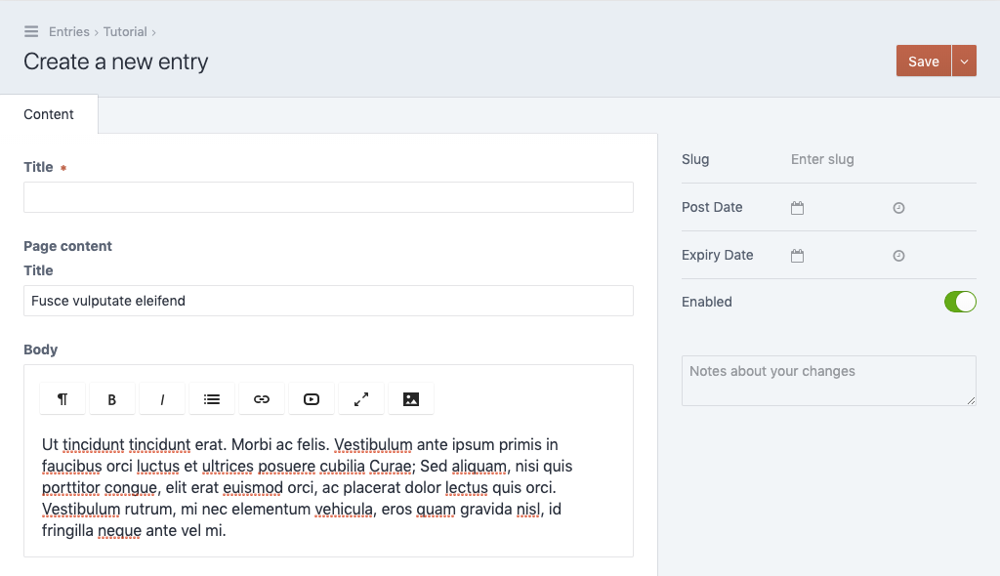

***********
Basic setup
***********

Create an entry template
========================

In the next steps we'll create a new section inside the Craft CMS and add
a content field named :code:`pageContent` to the entry type of that section.

Each section type in Craft is tied to a template that will render entries inside
that section. So lets start by creating that basic entry template. Create a new
file named :code:`tutorial-section.twig` in your :code:`templates` directory and paste the
following code into it.

.. code-block:: twig
   :caption: templates/tutorial-section.twig

   <html>
   <head>
     <title>{{ entry.title }}</title>
   </head>
   <body>

   

   </body>
   </html>

This is a very basic html template that will output the markup of your content
field to the page. Note the special :code:`display` tag used to render the field
:code:`pageContent`. It's a twig token installed by the content field and it is
used to render elements of the content field quickly.

Create a content template
=========================

When using the content field, everything starts with a template. Templates
that should be used inside the content field must contain some additional
meta data in the form of a Yaml preamble. Yaml is a simple language that allows
us to write down structured data.

.. note::
   A quick guide to understand Yaml can be found here:
   https://github.com/planetjekyll/quickrefs/blob/master/YAML.md

We will now create the root template of our content field. Create a new file
named :code:`page-content.twig` in your :code:`templates` directory and paste
the following code into it.

.. code-block:: twig
   :caption: templates/page-content.twig

   label: Page content template
   fields:
     title:
       type: text
     body:
       type: redactor
   ---
   

     
       <h1>{{ title }}</h1>
     

     {{ body.html }}
   

Notice the yaml configuration above the twig template, all templates used by
the content field must contain a section like this.

- The only required setting is the :code:`label`, it contains the
  human readable name of the template.

- Most of the time you'll want to define one or more :code:`fields`. The
  content field will parse those fields and generate a form in the control
  panel for editors to fill out. Most of the fields only require one mandatory
  option, the field :code:`type`. As you can see, inside the twig template
  you can access the fields and output them.

Create a content field
======================

Now lets head back to the control panel end setup the necessary fields and
sections for our tutorial.

First we'll create the field, so navigate to the :code:`Settings` section
and open the :code:`Fields` page. Click on the :code:`New field` button in the
upper right corner.

- Fill out the name field, we'll use :code:`Page content` here.
- Make sure the field :code:`Handle` is set to :code:`pageContent` as we've
  used that handle in our section template.
- In the :code:`Field type` dropdown select the entry :code:`Content field`.
- A section called :code:`Root templates` will appear. Select the template named
  :code:`page-content.twig` we've created in the step before.

Your field settings should look like this:

With everything in place, click :code:`Save` in the upper right corner.

Create a section
================

As we have a field, we now need a section we can attach it to. Navigate to the
:code:`Settings` section and open the :code:`Sections` page. Click on the
:code:`New section` button in the upper right corner.

- Fill out the name field, we'll use :code:`Tutorial` here.
- In the site sections table, set the column :code:`Template` to
  :code:`tutorial-section.twig` (the name of the template we've created
  in the step "Create an entry template")

Your section settings should look like this:

With everything in place, click :code:`Save` in the upper right corner.

Attach the field
================

Finally we need to attach the content field to our newly created section. After
having created the new section, Craft will redirect us to the section overview.
Next to our new section :code:`Tutorial` wen can click on :code:`Edit entry types`
to display all entry types. By default Craft should have created an entry type with
the same name as the section :code:`Tutorial`, click on it.

- Create a new tab in your field layout. We've named it :code:`Content`.
- Attach the field :code:`Page content` to the new tab.

Your entry type settings should look like this:

With everything in place, click :code:`Save` in the upper right corner.

Create an entry
===============

We are done with our basic setup and can now create our first entry using the
content field. Navigate to the :code:`Entries` section and select the
:code:`Tutorial` channel. Click on the :code:`New entry` button in the upper
right corner.

You should see the following entry form. Note the :code:`Title` and :code:`Body`
fields, those are the two fields we've just defined in the Yaml section of our
content template.

After saving the entry you can also visit the page in the frontend, you should
see the title and body fields output.
