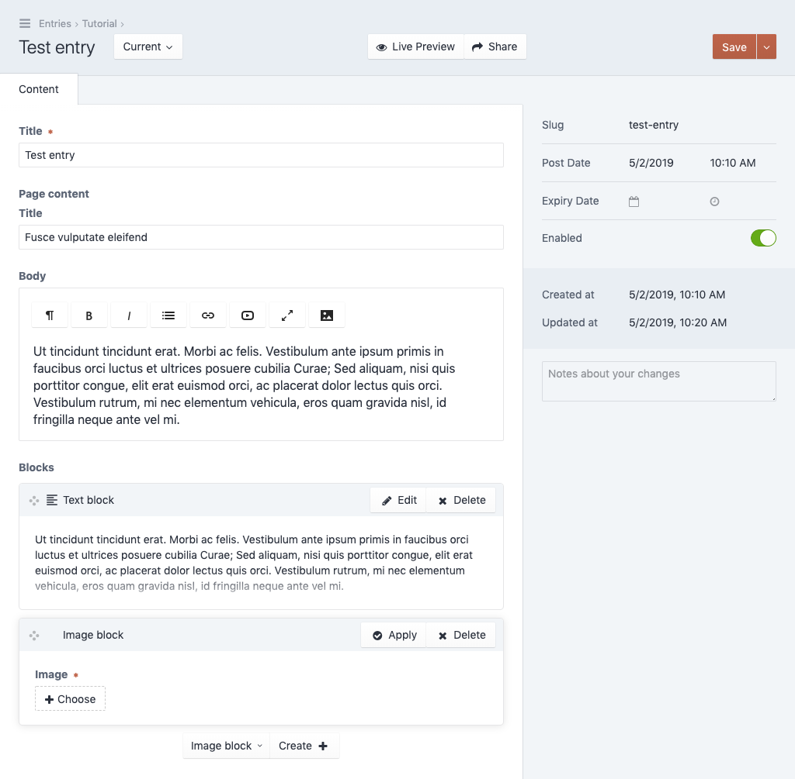

******************
Template hierarchy
******************

The real power of the content field unveils once you start building
template hierarchies. In the next steps we'll extend the basic sample
from the previous tutorial section by adding flexible content blocks.
We want the editor of the page to be able to stack text and image blocks.

Create block templates
======================

Head back to your templates directory and create a new directory named
:code:`blocks`. Inside that directory, create a new file called
:code:`text.twig` and paste the following code.

.. code-block:: twig
   :caption: templates/blocks/text.twig

   label: Text block
   icon: material:format_align_left
   preview: >
     {{ body.snippet }}
   fields:
     body:
       type: redactor
   ---
   

     {{ body.html }}
   

There are two new attributes in the Yaml block:

- The :code:`icon` attribute defines an icon for the template type in order to
  make blocks easier to distinguish in the control panel. A list of
  all available icons can be found in the control panel
  :code:`Utilities` > :code:`Content field utilities`.

- The :code:`preview` attribute contains a simple preview of the block that
  will be shown to the editor in the control panel. It's a handlebars template
  that has access to all fields defined in the current template.

.. note::
   You can learn more about handlebars templates on their official site:
   https://handlebarsjs.com/

Next create a new file called :code:`image.twig` in the same directory
and paste the following code.

.. code-block:: twig
   :caption: templates/blocks/image.twig

   label: Image block
   icon: material:picture
   preview: >
     {{ image }}
   fields:
     image:
       type: image
       rules: required
   ---
   

     
   

The image field type is a field that allows editors to select assets. Note
the :code:`rule` attribute on the image field, it marks the field as being
required.

Add the blocks to the content template
======================================

We'll now add those two block templates as a flexible list of entries
to our root template. Open the template of our content field
:code:`templates/page-content.twig` and make the following changes.

.. code-block:: twig
   :caption: templates/page-content.twig
   :emphasize-lines: 7-9,19

   label: Page content template
   fields:
     title:
       type: text
     body:
       type: redactor
     blocks:
       type: instances
       schemas: blocks/*
   ---
   

     
       <h1>{{ title }}</h1>
     

     {{ body.html }}
   

   

This defines a new field called :code:`blocks` of the type :code:`instances`.
An instance field is a field that can hold other templates. The attribute
:code:`schemas` specifies which other templates are allowed here. As you can
see one may use wildcards to allow entire directories of templates to be included.

Create an entry
===============

Again, head back to entries section of the control panel and add a tutorial entry.

