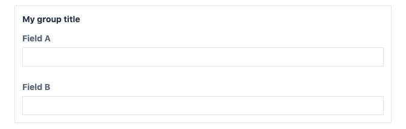
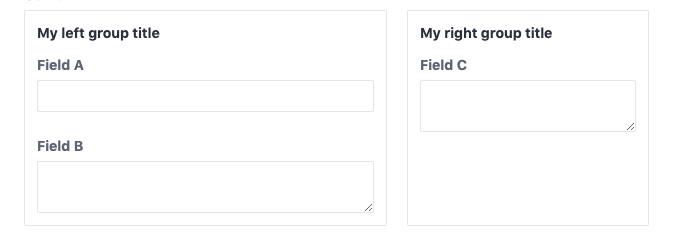
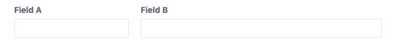

# Fields

For a complete list of all included fields, please see [fields](/fields/).

## Common attributes

### `group`

The group attribute allows you to group fields together. All following
fields will be put into a group until another group attribute occurs.
You can simply specify the label of the group:

```yaml
label: Group demo
fields:
  fieldA:
    type: text
    group: My group title
  fieldB:
    type: text
```

Which creates the following field group in the control panel:



You can also pass an option object to set multiple css properties
of the field group. Combined with the ability to specify grid layouts
on the schema (see ), you can build complex layouts.

```yaml
label: Group demo
grid: >
  "left right" / 3fr 2fr
fields:
  fieldA:
    type: text
    group:
      label: My left group title
      gridArea: left
  fieldB:
    type: textarea
  fieldC:
    type: textarea
    group:
      label: My right group title
      gridArea: right
```

Which creates the following layout in the control panel:



The following css attributes are supported:

- alignSelf
- gridArea
- gridColumn
- gridColumnEnd
- gridColumnStart
- gridRow
- gridRowEnd
- gridRowStart
- justifySelf
- placeSelf

### `instructions`

Additional instructions for the field in the control panel. Will be shown
beneath the field label.

```yaml
instructions: Additional instructions for this field.
```

### `label`

The primary label of the input field in the control panel. When omitted, a
label will be generated from the name of the field.

```yaml
label: My custom label
```

### `rules`

Defines the validation rules of the field. The content field uses the
validation mechanics of the Yii framework and you can use most of the
provided validators with the content field.

If you only need one validator and the validator does not require any
options, you may pass the name of the validator.

```yaml
rules: required
```

Otherwise you may supply a list of validators. The name of the validator
must be given by the `type` option. The following notation has the
same result as the previous example.

```yaml
rules:
  - type: required
```

This way you can set additional options on each validator:

```yaml
rules:
  - type: required
  - type: email
    checkMX: true
```

::: tip
A list of all validators can be found here:
[yiiframework.com](https://www.yiiframework.com/wiki/56/reference-model-rules-validation)
:::

### `width`

Defines the width of the field within the control panel. Allows you to stack fields
horizontally. Can be any valid css width value, can also be given as a fraction, e.g. `6/12`.

```yaml
label: Width demo
fields:
  fieldA:
    type: text
    width: 4/12
  fieldB:
    type: text
    width: 8/12
```

Which creates the following layout in the control panel:



## Global field definitions
