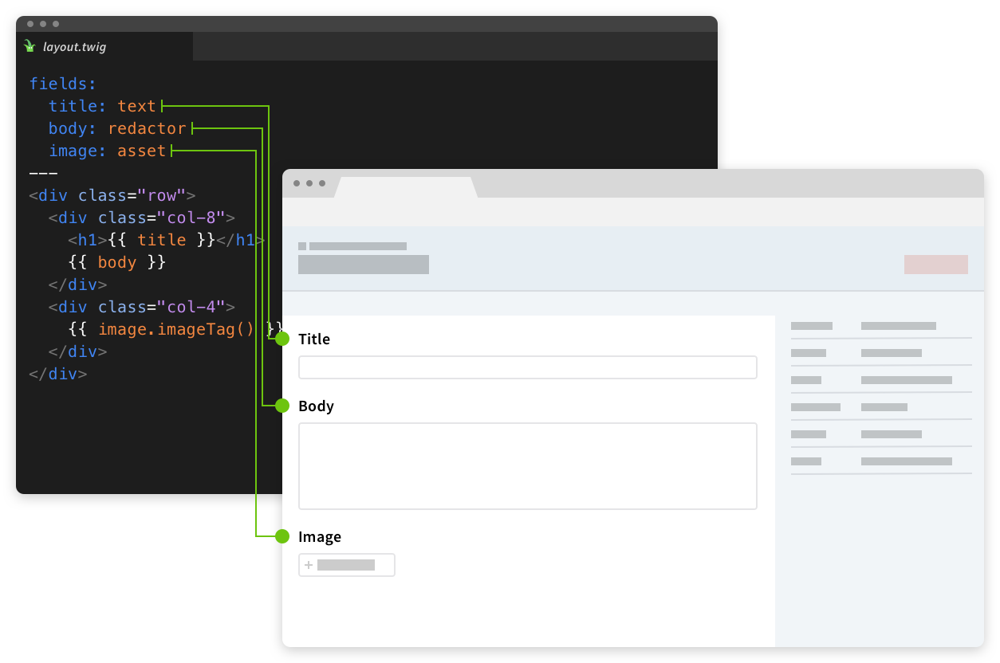
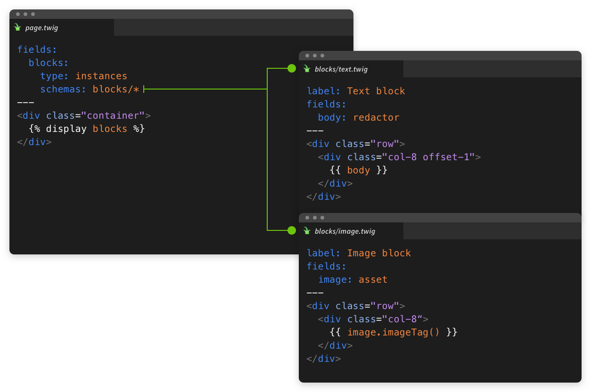
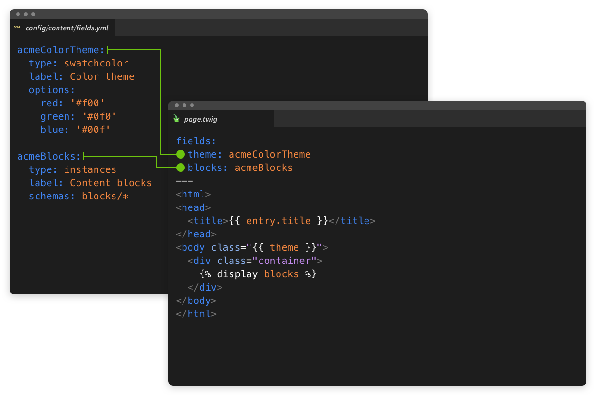
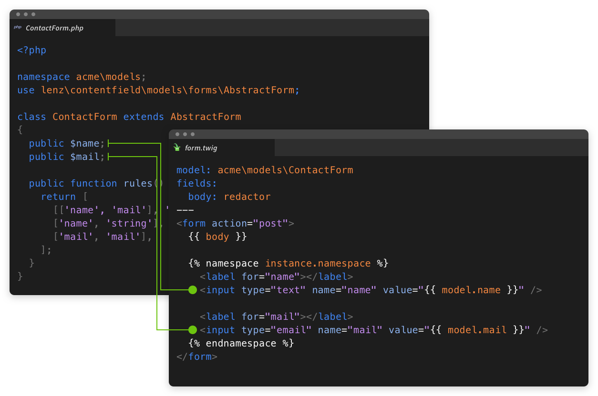

  

    
  

  

    <h3>Define data structures directly in your templates</h3>
    
Define the control panel fields required for a template directly within the template.

    
<router-link to="/guide/templates.html">Template schemas</router-link>

  

  

    <h3>Build complex content by stacking and nesting templates</h3>
    
The instance fields can contain other templates.

    

      <router-link to="/fields/instance.html">Instance field</router-link> 
      <router-link to="/fields/instances.html">Instances field</router-link>
    

  

  

    
  

  

    
  

  

    <h3>Edit content directly within the preview</h3>
    
Add, edit or remove blocks of content within Crafts preview.

    
<router-link to="">Live preview</router-link>

  

  

    <h3>Reuse fields, structures and image tags: define them globally.</h3>
    
Nobody likes to repeat themselfes.

    

      <router-link to="/guide/fields.html#global-fields">Global fields</router-link> 
      <router-link to="/guide/structures.html#global-structures">Global structures</router-link> 
      <router-link to="">Global image tags</router-link>
    

  

  

    
  

  

    
  

  

    <h3>Optimize page render times.</h3>
    
By batching together element queries the content field is already fast on its own. Inlining allows it to be even faster.

    
<router-link to="">Template inlining</router-link>

  

  

    <h3>Add custom models for form and view logic.</h3>
    
Each template can be coupled with a Yii model class, enabling a clean way of attaching business logic to templates.

    
<router-link to="">Models</router-link>

  

  

    
  

  

    
  

  

    <h3>Partially render pages.</h3>
    
Use ajax to reload parts of your page, e.g. for filtering lists or sending forms.

    
<router-link to="">Chunk rendering</router-link>

  

