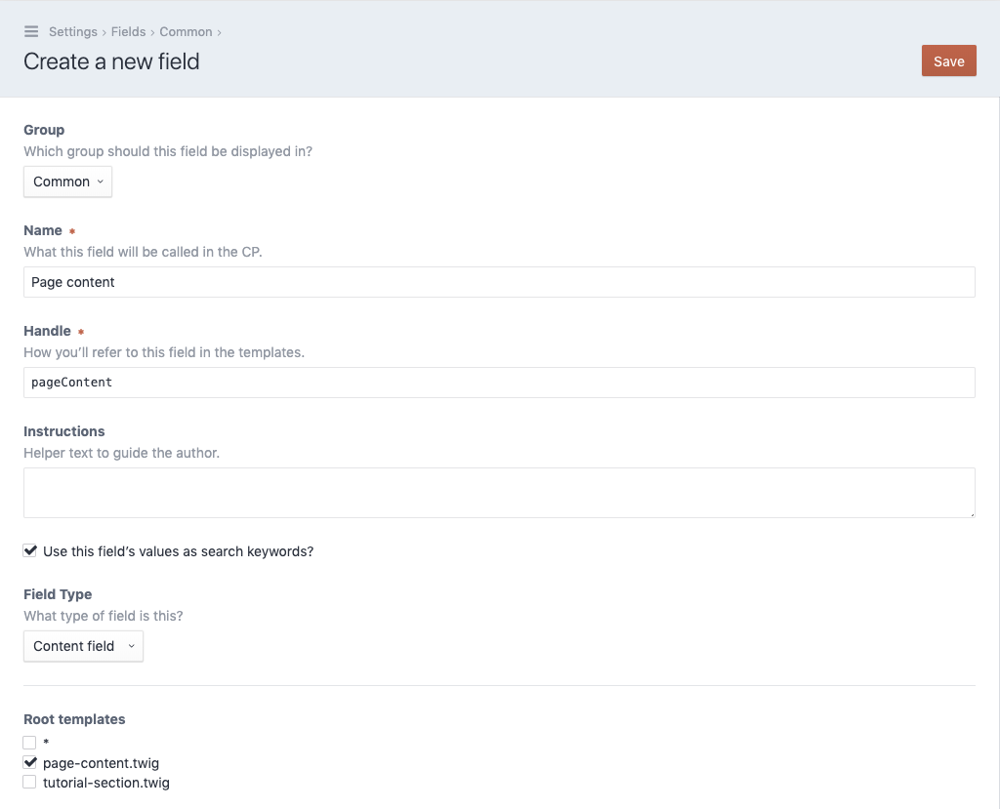

# Create a content field

Now lets head back to the control panel end setup the necessary fields and
sections for our tutorial.

First we'll create the field, so navigate to the `Settings` section
and open the `Fields` page. Click on the `New field` button in the
upper right corner.

- Fill out the name field, we'll use `Page content` here.
- Make sure the field `Handle` is set to `pageContent` as we've
  used that handle in our section template.
- In the `Field type` dropdown select the entry `Content field`.
- A section called `Root templates` will appear. Select the template named
  `page-content.twig` we've created in the step before.

With everything in place, click `Save` in the upper right corner.
