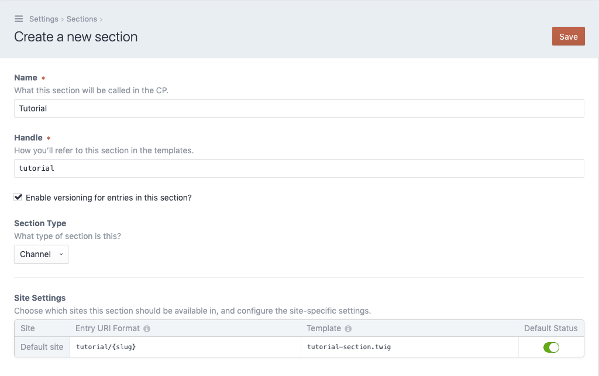

# Create a section

As we have a field, we now need a section we can attach it to. Navigate to the
`Settings` section and open the `Sections` page. Click on the
`New section` button in the upper right corner.

- Fill out the name field, we'll use `Tutorial` here.
- In the site sections table, set the column `Template` to
  `tutorial-section.twig` (the name of the template we've created
  in the step "Create an entry template")

With everything in place, click `Save` in the upper right corner.
