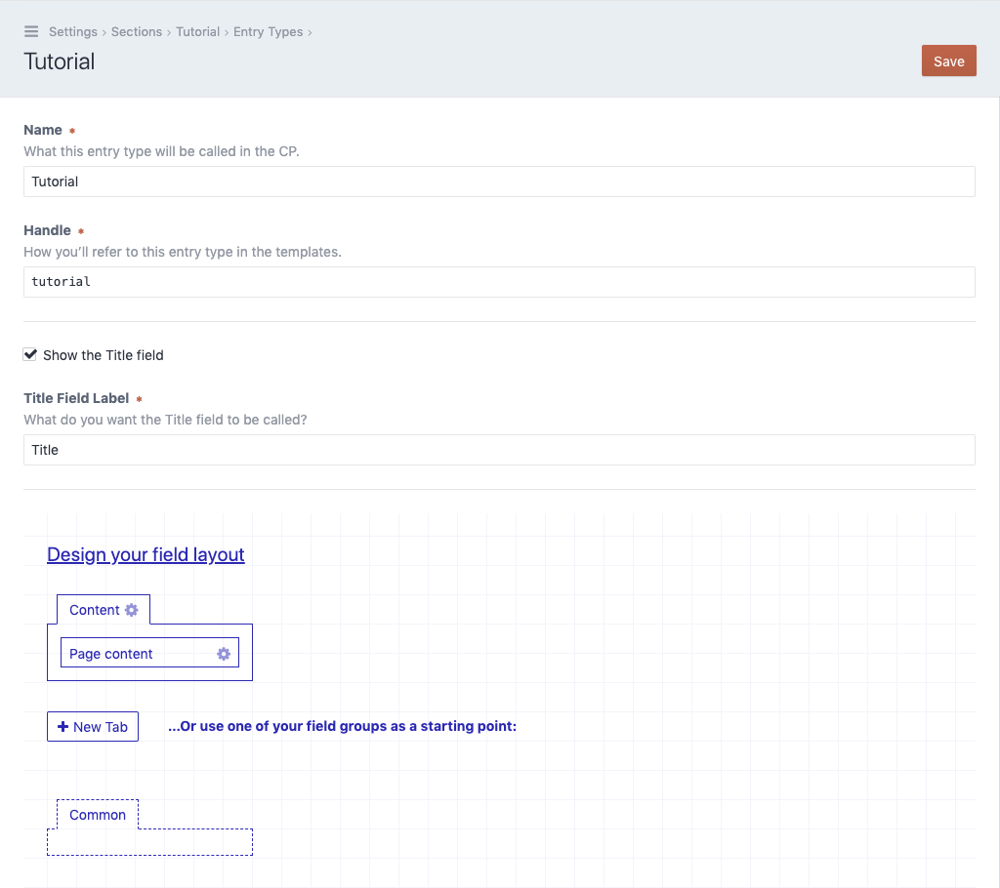

# Attach the field

Finally we need to attach the content field to our newly created section. After
having created the new section, Craft will redirect us to the section overview.
Next to our new section `Tutorial` wen can click on `Edit entry types`
to display all entry types. By default Craft should have created an entry type with
the same name as the section `Tutorial`, click on it.

- Create a new tab in your field layout. We've named it `Content`.
- Attach the field `Page content` to the new tab.

With everything in place, click `Save` in the upper right corner.
