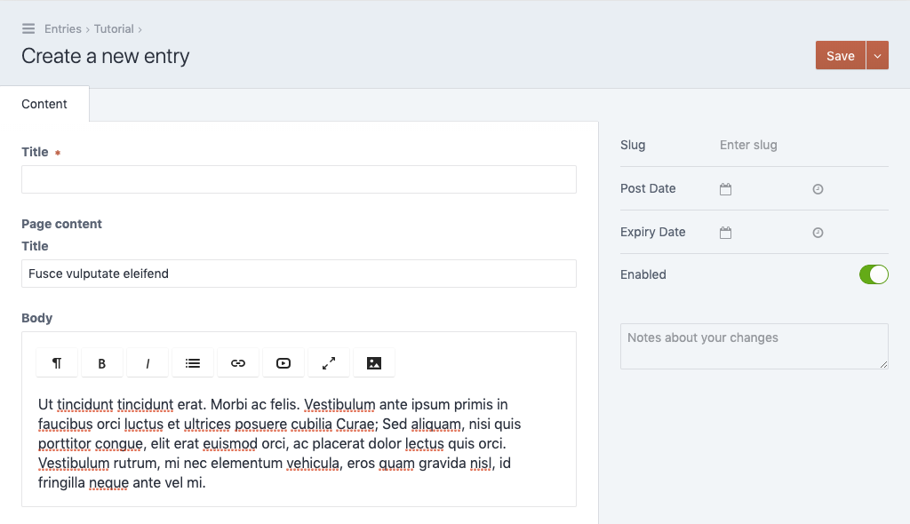

# Create an entry

We are done with our basic setup and can now create our first entry using the
content field. Navigate to the `Entries` section and select the
`Tutorial` channel. Click on the `New entry` button in the upper
right corner.

You should see the following entry form. Note the `Title` and `Body`
fields, those are the two fields we've just defined in the Yaml section of our
content template.

After saving the entry you can also visit the page in the frontend, you should
see the title and body fields output.
