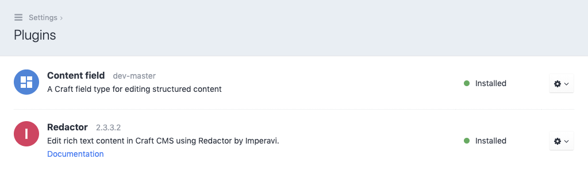

# Installation

## Download the plugin

You can either download the content field using the Craft plugin
store or by using composer.

- **Craft plugin store**

  Open the control panel of your site, open the section
  `Plugin Store` and search for "Content field". On the detail
  page of the plugin, find and click the button `Install`.

- **Composer**

  Open a terminal and navigate to the root directory of your Craft
  installation. Using composer you can install the plugin by typing:

  ```shell
  $ composer require sebastianlenz/contentfield
  ```

## Install the pugin



After you have downloaded the plugin, open the control panel of
your site, open the section `Settings` and navigate to the
`Plugins` page. Install the plugin by clicking on the gear
icon next to the content field plugin and select `Install`.

::: tip Optional
Do the same with the Redactor plugin.
:::
